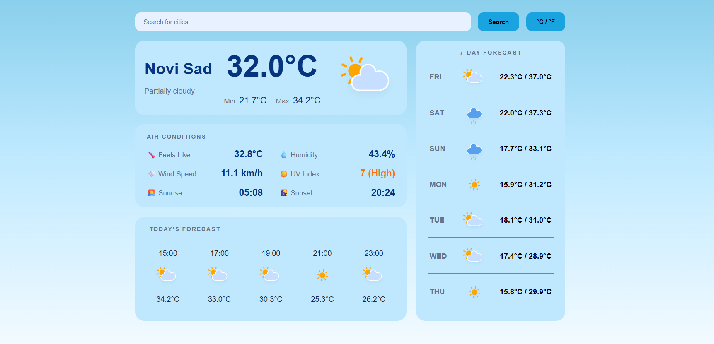
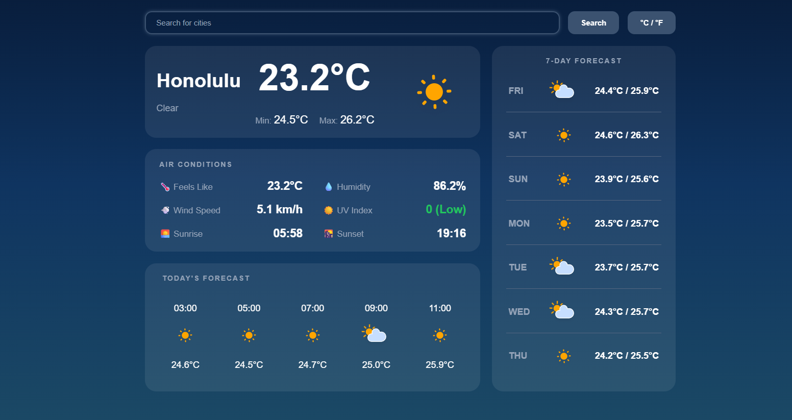
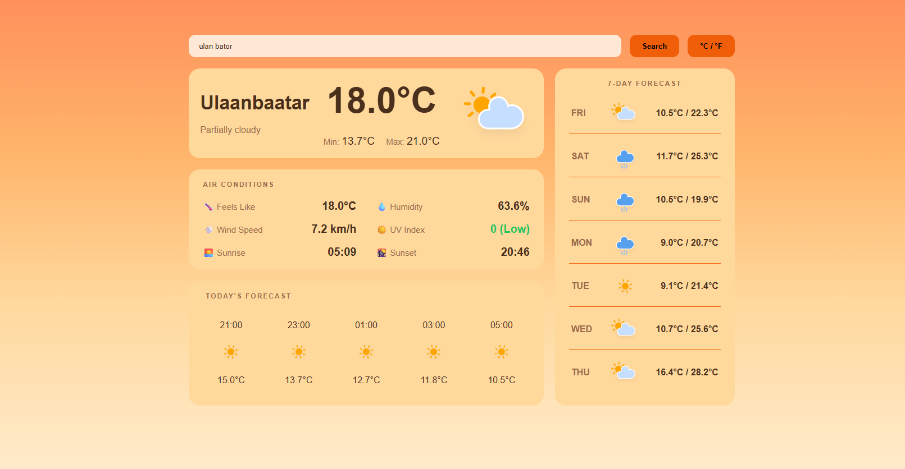

# WeatherApp 🌤

A simple weather forecast application built as part of The Odin Project curriculum.  
It uses **HTML, CSS, JavaScript**, and **Webpack** for bundling and project organization.

---

## 🚀 Features
- Search weather by city
- Display current temperature, description, and icons
- Display 7-days forecast
- Display hourly forecast view
- Different themes for day, night and sunrise/sunset
- Responsive design

---

## 🛠️ Technologies
- HTML, CSS, JavaScript (ES6+)
- Webpack (bundling, dev server)
- OpenWeather API

---

## 🌐 Deployment
The app is deployed on GitHub Pages:  
👉 https://bozicag.github.io/Weather-app/

---

## 📚 Lessons Learned
- Learned how to configure Webpack for JS, CSS, and assets
- Practiced handling API requests and dynamic UI updates
- Learned how to handle asynchronous calls
- Understood how to work with `response.json()` to parse API data
- Improved project structure for clarity and scalability

---

## 📸 Screenshots

### Day Theme

### Night Theme

### Sunrise/Sunset Theme

